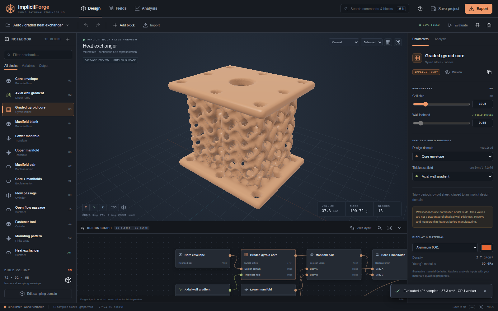

# ImplicitForge

**A browser-native implicit modeling and computational-engineering workbench.**

Version **0.1.0** · HTML / CSS / JavaScript / WGSL · MIT · no runtime dependencies



ImplicitForge is an original implementation of an nTop-inspired workflow: a typed notebook and node graph define continuous implicit bodies, scalar fields drive geometry, and the same model feeds rendering, meshing, analysis, optimization, and export. The controls execute real kernels; the viewport is not a prerecorded image or animation.

This release is a working independent workbench, **not full nTop feature parity**, a reader for proprietary nTop documents, or a certified engineering solver. Its numerical methods and limits are explicit in [NUMERICS.md](docs/NUMERICS.md).

## Run

Open **`ImplicitForge.html`** for the portable, offline edition. It contains the application, styles, and worker implementation in one file. Browser permissions determine which GPU and persistence features are available. The software renderer and worker-based CPU kernels remain available without WebGPU.

For the source edition, use Node.js 20 or newer:

```sh
cd ImplicitForge
npm start
```

Open `http://localhost:4173`. There is **no dependency installation step**. Hosting on localhost or HTTPS is the preferred way to expose browser GPU capabilities. The development server listens on all interfaces; do not expose it as a hardened public service.

```sh
npm run build    # portable HTML, static dist/, and 12 standalone ESM packages
npm run check    # JavaScript syntax validation
npm test         # kernel, numerics, mesh/I/O, document and package tests
```

Deploy the contents of `dist/` to a static host. Keep its relative directory structure. No server-side computation, account, API key, external font, telemetry, CDN, or backend service is required. GitHub Pages: [Open ImplicitForge](https://wieslawsoltes.github.io/ImplicitForge/). The Pages workflow builds and validates the application before deployment.

## Workflows implemented

**Modeling:** 33 block types; seven primitives; set operations and smooth unions; offset/shell; translation, Euler rotation, uniform scale, twist, finite arrays; six lattice families; scalar constants, ramps, radial and wave fields, deterministic procedural modulation, arithmetic and clamps; imported sampled bodies. Fields can drive supported radius, offset, shell, and lattice parameters.

**Editing:** synchronized notebook and typed node graph; drag nodes and create connections; schema-derived parameter controls; add, duplicate, delete, preview and set output; cycle/type validation; undo/redo and merged slider transactions; graph arrangement and navigation; command palette; project import/export; IndexedDB recovery where available; dark/light themes and narrow-screen drawers.

**Rendering:** WebGPU fragment ray marching over generated implicit functions, WebGL 2 fallback, and a real software triangle rasterizer as the final fallback. Orbit, pan, zoom, touch gestures, orthographic views, automatic rotation, capped section planes, field/normal/analysis coloring, adaptive interaction resolution, quality levels, ground grid and PNG snapshots are implemented. Export always uses the complete output body, not display clipping.

**Computation:** WebGPU field sampling and finite-volume thermal Jacobi kernels; cancellable CPU worker counterparts; welded indexed isosurface extraction; occupied-volume/mass integration; surface/topology statistics; Hex8 linear elasticity; SIMP compliance optimization; parameter sweeps with CSV output. FEM and SIMP execute on the CPU, not as pretend GPU placeholders.

**Interchange:** native `.iforge` JSON project persistence, including graph and volume assets; STL and OBJ mesh import through BVH distance sampling; STL, OBJ, binary PLY and 3MF mesh export; SVG slices; PNG renders; CSV design studies. STL is interpreted in millimetres because that format carries no unit metadata.

## Try the examples

The project menu contains seven modeled notebooks and an empty notebook. Their editable `.iforge` counterparts are in `examples/`.

| Notebook | What it exercises |
|---|---|
| Graded heat exchanger | Gyroid, axial thickness field, manifolds, boolean drilling, finite array |
| Gyroid material study | Radial field binding and lattice coupon |
| Lightweight mounting bracket | Rounded primitives, placement, smooth union, subtractive tools |
| Schwarz P toroid | Periodic nodal sheet in a toroidal envelope |
| Octet structural coupon | Field-varying beam radius and cylindrical clipping |
| Cantilever benchmark | Solid design space for elasticity and topology optimization |
| Twisted diamond column | Diamond nodal sheet and coordinate-space warp |

The heat-exchanger notebook is geometric: it does not simulate fluid flow. Use the solid cantilever to explore numerical-analysis settings before attempting sparse lattices that the analysis grid may not resolve.

## Standalone packages

The app imports the library source directly; modeling and numerical kernels are not hidden inside the UI. Every package also builds an independently importable, self-contained ESM bundle at `packages/<name>/dist/index.js`. These bundles deliberately embed their internal dependencies, so copying one package to another project does not require copying sibling packages.

| Package | Responsibility |
|---|---|
| `@forge/kernel` | Vectors, bounds, grids, events, cancellation and utilities |
| `@forge/graph` | Block schemas, typed ports, dependency order and validation |
| `@forge/document` | Transactions, undo/redo, immutable shared assets and persistence |
| `@forge/field` | Primitive distance helpers, volume interpolation and shader helpers |
| `@forge/lattice` | Gyroid, Schwarz P, diamond, Neovius, cubic and octet kernels |
| `@forge/compile` | Typed graph → CPU closures, WGSL and GLSL; parameter buffers |
| `@forge/compute` | GPU buffers/pipelines, parallel field/thermal kernels, worker client |
| `@forge/mesh` | Sampling, welded tetrahedral isosurfaces, topology metrics and BVH |
| `@forge/analysis` | Volume/mass, finite-volume conduction, Hex8 FEM and SIMP |
| `@forge/io` | Project-independent mesh formats, ZIP/3MF and section SVG |
| `@forge/render` | Implicit GPU/WebGL rendering, software fallback and orbit camera |
| `@forge/ui` | Node graph, dialogs, notifications, splitters, icons and theme CSS |

These are local package artifacts; no claim is made that the `@forge/*` names are available or published on npm. See each package's README and [API.md](docs/API.md). `npm pack ./packages/mesh` produces an installable package without a registry upload.

## Validation and limits

Read [VALIDATION.md](docs/VALIDATION.md), the raw TAP report, browser JSON report, and executable tests. The browser regression exercises real file downloads/imports, history, workers, FEM, thermal analysis, optimization, cancellation and mobile layout.

**The supplied automated browser environment has neither WebGPU nor WebGL 2.** Its observed backend is `CPU raster`. GPU shaders and runtime code are implemented, but actual GPU execution and CPU/GPU agreement were not verified on this machine. `tests/gpu.html` contains the hardware validation harness, including every block type, thermal agreement and example render pipelines. Unavailable hardware is reported as skipped, never as passed.

The current release does not implement B-rep/STEP/IGES CAD, native nTop files, arbitrary custom-code blocks, production nonlinear/contact FEM, fluid dynamics, fatigue, manufacturing qualification, adaptive octree meshing, enterprise collaboration, or a complete accessibility/hardware audit. Sampled features, mesh import, field-driven isobands, voxel analysis and thresholded topology all require resolution/convergence checks before engineering use.

## Documentation

[User guide](docs/USER_GUIDE.md) · [Architecture](docs/ARCHITECTURE.md) · [API and schema](docs/API.md) · [Numerical methods](docs/NUMERICS.md) · [Block catalogue](docs/BLOCKS.md) · [Validation](docs/VALIDATION.md)
